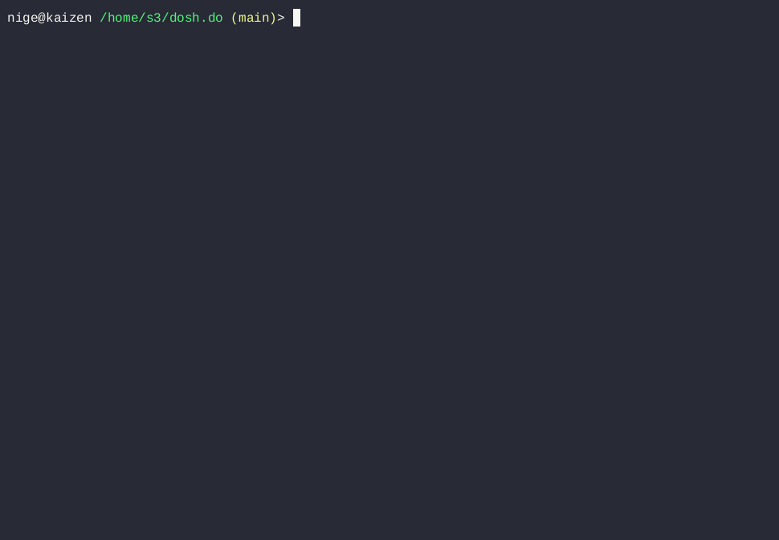

# dosh (do shell) - LLM-powered shell commands

Make a request using natural language and **dosh** suggests a shell command to fulfil your request. 

The command will NOT execute without your confirmation. Please be careful when confirming. 

The command suggestion includes an explanation of what the command does, and a warning if the command will make changes.

Configure the LLM settings with `dosh config`.

## Usage
```
    shell> dosh ask for what you want              -- in natural language
    
    shell> dosh what processes are using the most memory 
    shell> dosh how much disk space is left
    shell> dosh what programs have ports open
    shell> dosh remove .tmp files larger than 100 meg 
    
    shell> dosh config                             -- change LLM settings
    shell> dosh help                               -- show this help
```

## Demo



## Install

**dosh** is a Raku command-line utility.

1. Install Raku

    [https://raku.org/downloads/](https://raku.org/downloads/)

2. Install dosh 
    
    ```
    shell> zef install dosh
    ```
3. Set up your LLM with LLM::DWIM

    ```
    shell> dosh config
    shell> rakudoc LLM::DWIM
    ```
